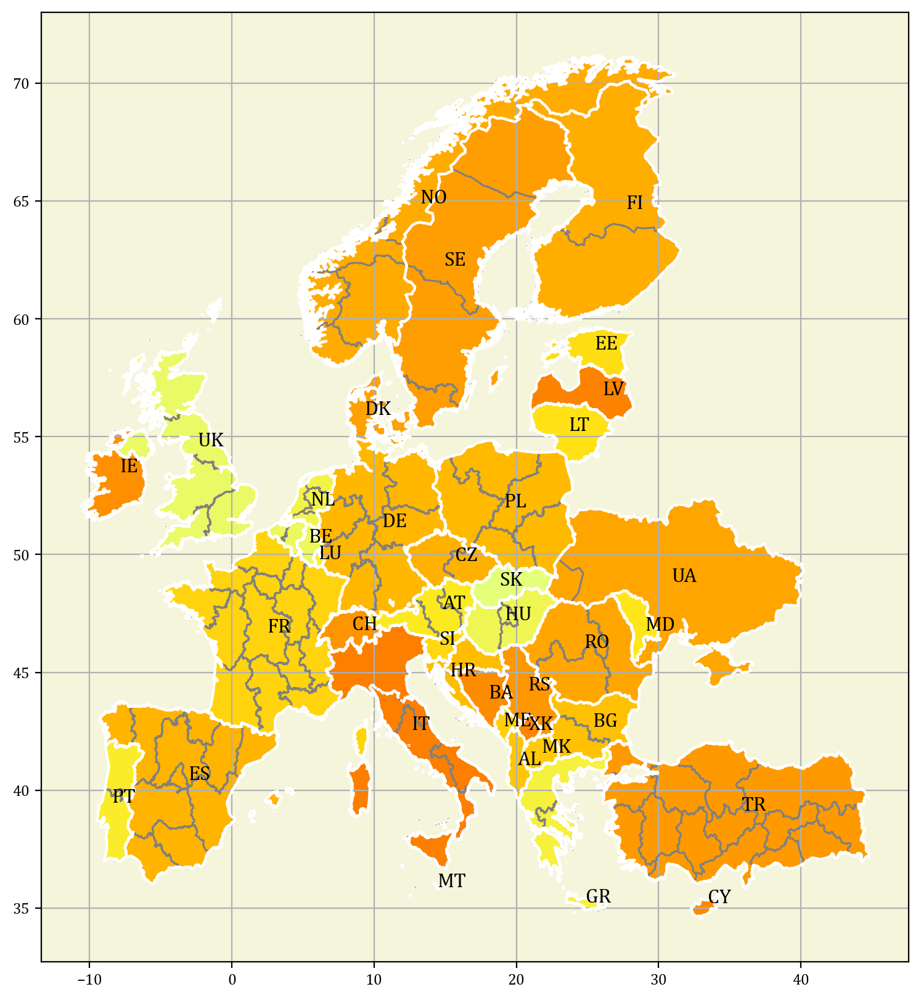
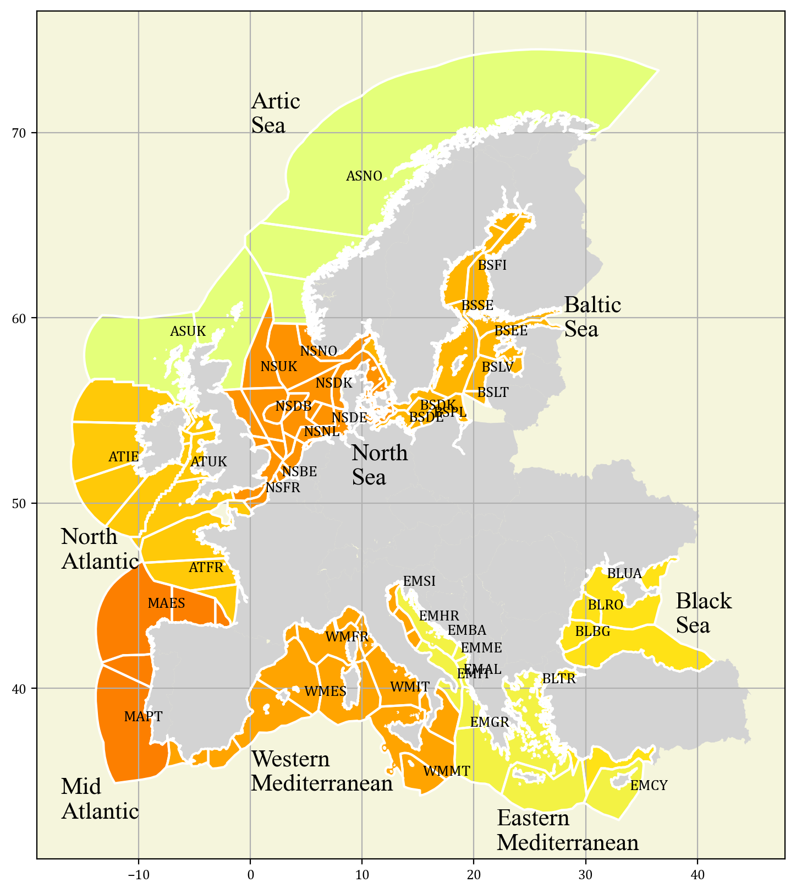

This framework contains information about the following sectors in Europe:
* Variable Renewable Energy
* Hydro, reservoirs and run-of-river
* Biomass
* Energy conversion and storage
* Electricity transmission
* Methane and hydrogen
* Cargo transport of key energy carriers
* Industry, 
* Buildings, non-residential and residential, heating and cooling
* Transport, road, rail, aviation and shipping
* Residual electricity demand

# Spatial Scope
This dataset includes data of EU27 plus UK, CH and NO.

# Resolution

## Onshore
* __PECD1__: We use this resolution as country level.
* __PECD2__: Spatial distribution carries out in ENTSO-E studies, see explanation [here](https://corres.windenergy.dtu.dk/open-data).
* __NUTS2__: Basic regions, see details [here](https://ec.europa.eu/eurostat/web/nuts/) (v2021).
* __NUTS3__: Small regions, see details [here](https://ec.europa.eu/eurostat/web/nuts/) (v2021).

**PECD2 polygons**

**NUTS3 polygons**

## Offshore
* __OFF1__: Seabasin resolution (North Sea, Baltic Sea, North Atlantic, Western Mediterranean, etc).
* __OFF2__: Seabasin and country resolution. Zones differentiated by seabasin and country.
* __OFF3__: Highest resolution used in ENTSO-E, more granular than OFF3.

**OFF3 polygons**

# VRE
This pipeline counts with a set of different technologies:

* Onshore wind - specific power (W/m2) could be 199, 270 or 335 and hub height (m) could be 100, 150 or 200. 
* Offshore wind, fixed bottom or floating - specific power (W/m2) could be 316 or 370 and hub height (m) could be 155. 
* Solar PV: rooftop, no tracking axis and one tracking axis.

Link to data: [zenodo](https://zenodo.org/records/17950648)
## Parameters
* Capacity factors: weather years 1980-2021.
* Existing capacity and expected decommissions, MW.
* Installable capacity per technology type and region, MW.
* Capital investment (€/MW), fixed O&M (€/MW/year) and variable O&M (€/MWh) costs for 2030/2040/2050 (EUR 2025).

## Resolution

__Data resolution__: PECD2
* PECD2. Aggregation to PECD1 via summing capacities and capacity-weighted capacity factors (existing vs. future technologies, existing capacity and installable capacity). Downscaling to NUTS2/3 uses area as conversion factor and polygon-averaged capacity factors. 
* For offshore, resolution at OFF3, aggregation to OFF1 and OFF2 via summing capacities and capacity-weighted capacity factors. 

# Hydro

Link to data: [zenodo](https://zenodo.org/records/18632738)
## Scope
* Reservoir-based turbines, run-of-river and pumped-hydro storage. 
* Run-of-river modeled as fixed production with curtailment; reservoirs modeled as storage (turbine discharge with inflow as charge) and pumped-hydro storage 
* as standard storage technologies. 

## Parameters
* Inflows; run-of-river generation (1980–2023). 
* Max/min turbine output; reservoir and turbine existing capacities (MWh and MW). 
* Ramp constraints for the turbines (MW/h).
* Efficiency of hydro turbines (piecewise linear function).
* Fixed O&M (€/MW/year) and variable O&M (€/MWh) costs for 2030/2040/2050 (EUR 2025). 

## Resolution
* __Data resolution__: PECD1
* For PEC2, NUTS2 and NUTS3, existing capacity is transformed using the area as a conversion factor and, for time series, using the average of the polygons intersecting the target polygon.

# Biomass
For this pipeline, this dataset includes the annual production of biomass per region, where there are three potential scenarios, low, medium and high.

The biomass is modeled as a dummy storage that starts with the amount of energy that is produced during the year. This storage can only discharge.

## Parameters
* Annual production (MWh/year). 
* Production costs (€/MWh) in EUR 2025. 

## Resolution
* __Data resolution__: PECD1
* For PEC2, NUTS2 and NUTS3, downscaling to PECD2/NUTS2/NUTS3 uses area for production and polygon averages for operational cost. 
* Raw data can be transformed at NUTS3 (2013 vintage). 

# Energy Conversion and Storage
This pipelines models the power sector existing assets, mainly thermal generation and storage.

## Thermal generation & Other
* Super Pulvurized Coal Power Plant (option with carbon capture available)
* Nuclear Power Plant
* Combined-cycle Power Plant (option with carbon capture available)
* Open-cycle Power Plant
* Biomass steam turbine
* Waste steam turbine
* Hydrogen-based gas turbine

## Storage
* Lithium Battery Storage, utility scale
* Iron Air Storage

## Parameters
* Existing capacity and expected decommissions (MW).
* Capital investment (€/MW), fixed O&M (€/MW/year) and variable O&M (€/MWh) costs for 2030/2040/2050 (EUR 2025). 
* Efficiency
* Carbon capture rate (ton CO2/MWh input). 

## Resolution
* __Data resolution__: PECD1, PECD2, NUTS2, NUTS3 (default one)
* The raw data can be imported using all mopo resolutions. The user just need to configure the corresponding importer.

# Electricity Transmission
This dataset accounts for the cross-border power capacity in Europe modeling it as net transfer capacity.

Link to data: [zenodo](https://zenodo.org/records/14501623)

## Parameters
* Exiting capacity (MW).
* Installable capacity (MW).
* Investment cost (€/MW) for 2030/2040/2050 (EUR 2025). 

## Resolution
* __Data resolution__: PECD1
* Working on having more resolutions available.

# Methane and Hydrogen
In this pipeline, methane and hydrogen networks (investments available) are modeled as well as technologies to produce syn- and bio-gases. The networks are modeled for cross-border resolution and as net transfer capacities. Additionally, it includes data for gas underground (CH4) and salt-cavern (H2) storages.

Link to data: [zenodo](https://zenodo.org/records/18590390)

## Methane
* LNG terminals
* Gas extractions
* Imports to EU
* Methanation
* Biomass digestion and upgrading
* Biomass digestion and methanation
* Biomass gasification and methanation

## Hydrogen
* Steam methane reforming
* Steam methane reforming with carbon capture
* Electrolysis, PEAM, AEC and SOEC
* Gas pyrolysis

## Parameters
* Capital investment (€/MW), fixed O&M (€/MW/year) and variable O&M (€/MWh) costs for 2030/2040/2050 (EUR 2025). 
* Efficiency
* Carbon capture rate (ton CO2/MWh input). 
* Existing capacity (MW). 
* Tariff (€/MWh) in EUR 2025. 
* Installable capacity (MW).

## Resolution
* __Data resolution__: PECD1
* For PEC2, NUTS2 and NUTS3, the area is used as a conversion factor. For operational cost, we use the average of the polygons intersecting the target polygon.

# Cargo Transport
Cargo transport has been developed through a set of assumptions. The network for each country is created considering an existing connection of neighboring countries. The distance between countries is calculated through the centroids of each polygon and if the centroids are connected through a maritime route, then that route is realized using ships.

The energy carriers transfered in this network are biomass, methanol and hydrocarbon liquids (diesel, gasoline, kerosene, etc).

There is a fixed price per energy carrier, route type and distance.

## Resolution
* __Data resolution__: PECD1
* Addititional resolutions under development

# Buildings 
Heating and cooling are modeled endogenously as end-use demand. This dataset includes the final demands and the technologies that provide the demand.

Link to data: [zenodo](https://zenodo.org/records/18505234)

## Demands
* Non-residential space heating
* Residential space heating
* Non-residential domestic hot water
* Residential domestic hot water
* Non-residential cooling 
* Residential cooling

## Technologies
* Air heatpumps
* Ground heatpumps
* Biomass boilers
* Oil boilers
* Gas boilers
* Coal boilers
* Electric heaters

# Modeling Notes
For the sake of tractibility, the heat pumps have been simplified to supply a global heat demand that distributes the production among the different types. Therefore, the COP has been weighted to consider the expected domestic hot water and space heating demand. For instance, on average in x country, the domestic hot water demand is 20% and space heating is 80%, then we weighted the average COP that goes to space and water use.

The dataset accounts for district heating technologies but no demand has been implemented for this end use.

## Parameters

* Demand profiles (1995, 2008, 2009, 2012, 2015)
* Demand annual scale (resulting demand in MW). 
* COP (1995, 2008, 2009, 2012, 2015), air-to-air, air-to-water and ground-to-water
* Capital investment (€/MW), fixed O&M (€/MW/year) and variable O&M (€/MWh) costs for 2030/2040/2050 (EUR 2025). 
* Efficiency
* Existing capacity and expected decommissions (MW).

## Resolution
* __Data resolution__: PECD1
* For PEC2, NUTS2 and NUTS3, existing capacity is transformed using the population as a conversion factor. For time series, as they are normalized and at country level, they are replicated in subsequent target polygons.

# Industry
This dataset includes different sectors driving industry economy.

Link to data: [zenodo](https://zenodo.org/records/18790091)

There are in total around 120 investable routes. Each route is modeled in a multi-input multi-output framework.

## Scope
This part includes several routes per sector, such as low carbon or electrified routes, in principle more than 80 routes in total. 
* Cement (NUTS3) 
* Chemicals (NUTS3) 
* Fertilisers (NUTS3) 
* Glass (NUTS3) 
* Refineries (NUTS3) 
* Steel (NUTS3) 

### Other Industry
For these sectors, as there is data available, two routes are provided per sector, the reference one, and a new alternative, mainly an electrified route. 
* Ceramics (NUTS0) 
* Non-ceramic minerals (NUTS0)
* Food, beverages and tobacco (NUTS0) 
* Machinery equipment (NUTS0) 
* Non-ferrous metals (NUTS0) 
* Pulp and paper (NUTS0) 
* Textiles and leather (NUTS0) 
* Transport equipment (NUTS0) 
* Wood and wood products (NUTS0) 

## Parameters
* Demand (constant, flat profile), ton or MWh 
* Investment (€/(ton/h) or €/MW) and fixed O&M (€/ton/year or €/MW/year) costs for 2030/2040/2050 (EUR 2025). 
* Conversion rates
* Carbon capture rate (ton CO2/output unit) and emission rates (ton CO2/output unit). 
* Existing capacity (ton/h or MW).

## Resolution 
Data is at NUTS3 and NUTS0 level. Population is used to transform the data into other resolutions. 

# Transport
Transport demand covers road, rail, aviation and shipping.

## Road transport
* Car
* Van
* Bus
* Truck

## Non-road transport
* Electric trains
* Combustion trains
* Planes
* Ships

## Parameters
* Electric road transport: normalized hourly profiles with flexibility scenarios (10% or 20% of vehicles provide G2V/V2G (Grid-to-Vehicle/Vehicle-to-Grid) services; remaining vehicles follow weekly profiles). 
* Demand profiles (not weather-dependent; repeated across weather years), normalized per vehicle. 
* Annual demand scale aligned with ENTSO-E’s Distributed Energy and Global Ambition scenarios from the 10-year network development plan (TYNDP) 2024, where the units are the number of vehicles per megawatt. 
* Flexibility parameters: connected share, available capacity, departure energy, charge/discharge power, and efficiencies by charger type. 

## Resolution
* __Data resolution__: PECD1
* To PECD2/NUTS2/NUTS3, fleet and annual demand scaled based on population; normalized country-level time series replicated to sub-regions. 

# Residual Electricity Demand

Link to data: [zenodo](https://zenodo.org/records/18759195)

## Parameters
* Demand profiles: weather years 1982-2021, MWh.

## Resolution
* __Data resolution__: PECD1
* For PEC2, NUTS2 and NUTS3, the demand time series are transformed using the population as a conversion factor. 
