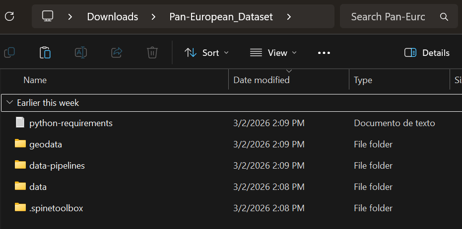
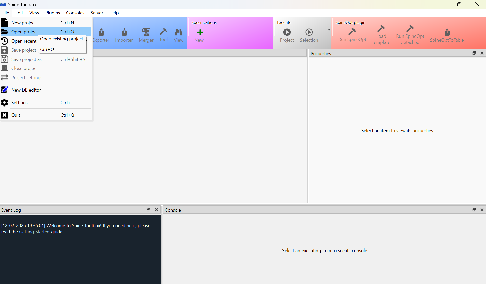
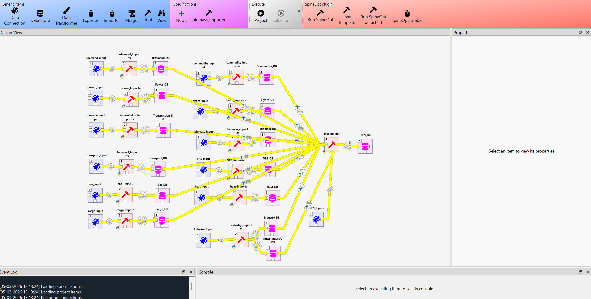

The dataset must be opened through SpineToolbox (from v0.11.0, [SpineToolbox](https://github.com/spine-tools/Spine-Toolbox)). Spine Toolbox is an open source Python package to manage data, scenarios and workflows for modelling and simulation. You can have your local workflow, but work as a team through version control and SQL databases.

The main folder contains a configurable file (userconfig.yml) to develop your target model, that, deciding the spatial, temporal and technological scope. In principle, running INES builder tool as it is, the user will get the whole Pan-European sector-coupled model at country resolution for onshore and seabasin-country resolution for offshore. The target model is formatted through an interoperable energy system data specification [INES](https://github.com/ines-tools/ines-spec).

# Use This Dataset

Run SpineToolbox and open the dataset spine project ("file" tab). To do that, choose the folder that contains ".spinetoolbox" folder and the other ones.

The project structure consists of the data pipelines, that is, raw data connection, importer (Python script) and SQlite database, and the INES model database and its builder that is a Python script fed by the SQlite databases and the user configuration file.

The section [setup](setup.md) provides more details on how to configure your target model.