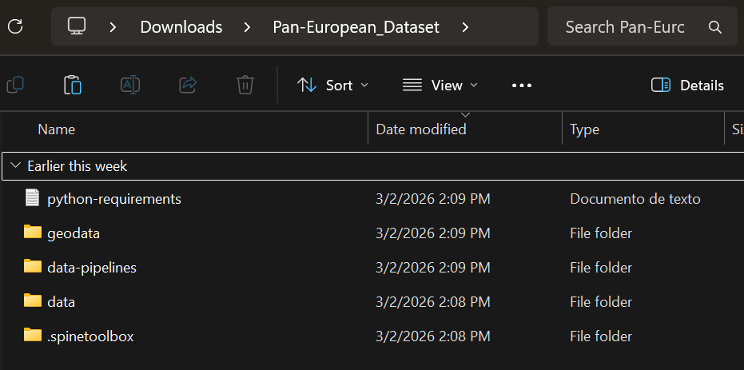
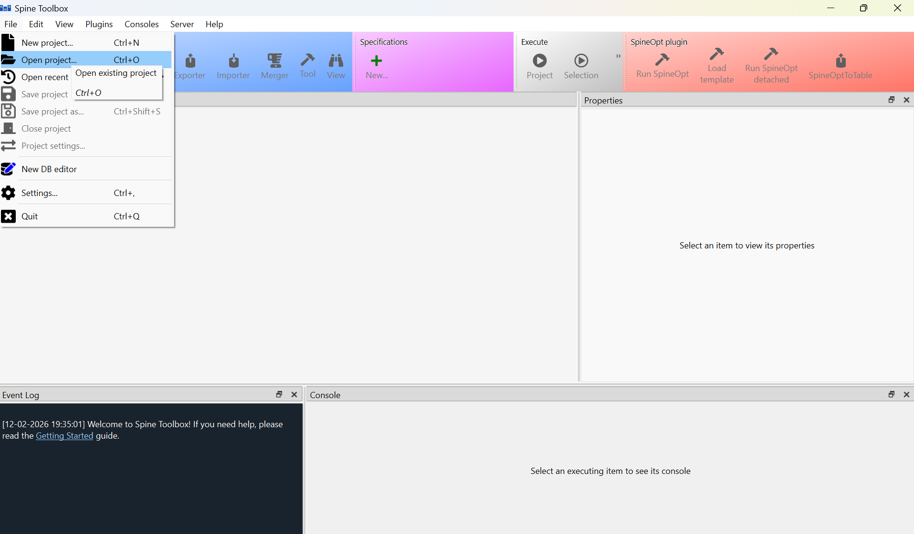
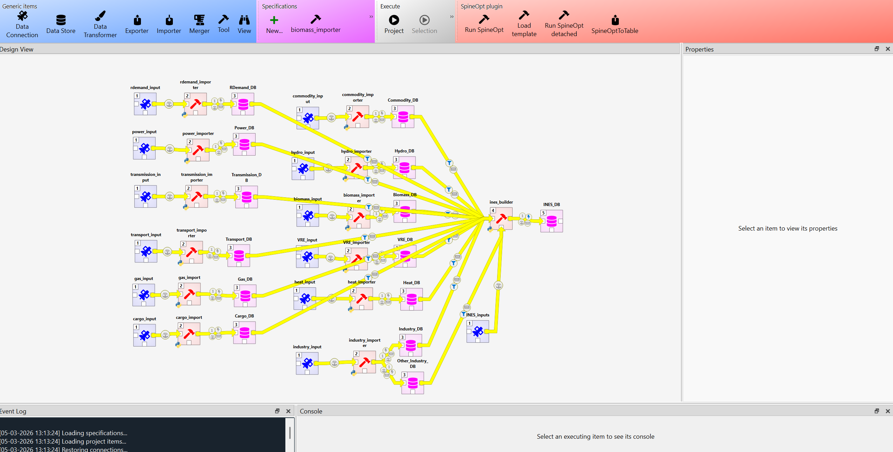

The dataset must be opened through SpineToolbox (from v0.10.5, [SpineToolbox](https://github.com/spine-tools/Spine-Toolbox)). Spine Toolbox is an open source Python package to manage data, scenarios and workflows for modelling and simulation. You can have your local workflow, but work as a team through version control and SQL databases.

The main folder contains a configurable file (userconfig.yml) to develop your target model, that, deciding the spatial, temporal and technological scope. In principle, running INES builder tool as it is, the user will get the whole Pan-European sector-coupled model at country resolution for onshore and seabasin-country resolution for offshore. The target model is formatted through an interoperable energy system data specification [INES](https://github.com/ines-tools/ines-spec).

# Use This Dataset

Run SpineToolbox and open the dataset spine project ("file" tab). To do that, choose the folder that contains ".spinetoolbox" folder and the other ones.

As shown in the next figure, the project structure comprises the data pipelines. In turn, a data pipeline comprises a raw data connections, an importer (Python script), a SQlite database, and the INES model database, that is, a SQlite database formatted using INES and its builder (a Python script fed by the SQlite databases and the user configuration file).

The workflow is structured into two key layers: (1) a data pipeline and (2) the INES model builder (Interoperable Energy System data specification). The data pipeline establishes the connection structure for locating all required raw datasets. It includes an importer, a Python script coupled with a Spine database  in SQLite schema, that transforms and normalizes the raw inputs into a model-ready format. 

The INES builder then integrates the resulting SQLite databases with a user configuration file through a dedicated Python script that interprets both inputs and generates the final model in INES format. 

Each pipeline database defines an intermediate staging schema that orchestrates the controlled transition of data from raw data structures to finalized INES model‑ready structures. This layered design ensures an auditable transformation workflow.

Through a sysconfig configuration file, a mapping is created between the source databases and INES. This allows mapping how an entity is named in each database and what the parameters of one database correspond to in another. For example, if there is a generator in the source database and I want it to correspond to a conversion unit in INES and to a connection of that unit with a node. For example, in terms of parameters, it allows you to map how a parameter is named in the source and in INES, multiplying it by a conversion factor. This configuration allows you to copy parameters directly, transform spatial parameters, define default parameters for certain entities, and impose user parameters from the userconfig.yaml file. 

A key strength of the workflow lies in its efficient read/write performance with Spine databases (SQLite schema) through the Spine DB Python API , combined with full programmatic control over classes, entities, parameters, alternatives, and scenarios. 

Please note that this is a first version that serves as a starting point, but new users can include their data pipeline and map their database parameters to those of INES through the sysconfig.yaml file.

The section [setup](setup.md) provides more details on how to configure your target model.