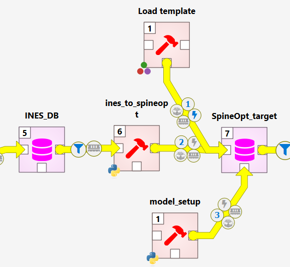
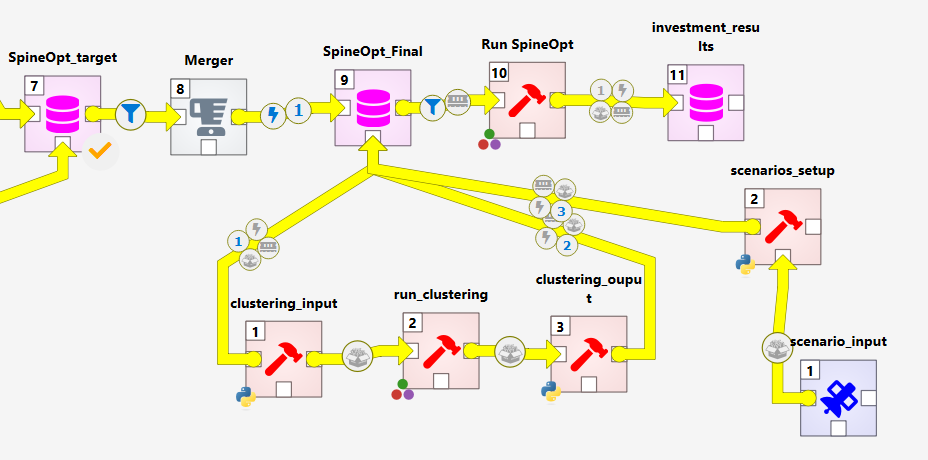

The resulting **INES** model is an energy system planning model that identifies investment needs and pathways to reach climate neutrality by **2050**. To run this planning model, you need two core components:

1. An **optimization tool** — in this case, **SpineOpt**.
2. A **time-series clustering tool** to reduce temporal dimensionality while preserving operability and long-term storage behavior.

This guide explains how to connect **SpineOpt** to the INES model and how to run the optimization with clustering.

---

# How to Connect SpineOpt

As part of INES, there is a repository of INES tools that handle data transformations (e.g., transforming INES models to **SpineOpt**, **PyPSA**, **Flextool**, etc.). In this guide, we focus on **SpineOpt**.

**Important:** SpineOpt is a plugin for **Spine Toolbox**. Install it following the official instructions:
- **SpineOpt installation:** <https://spine-tools.github.io/SpineOpt.jl/latest/getting_started/installation/>

Once installed, Spine Toolbox will include a new item bar with SpineOpt items:


Your goal is to connect **SpineOpt** to the **INES** model as illustrated below. The following sections explain each component and how to add them.



## Elements

### **Load template**
Spine databases use **structural templates** that are populated by tools or importers. SpineOpt reads a specific template to build the JuMP optimization model to be solved by a solver. See the concept reference:
- **SpineOpt parameters:** <https://spine-tools.github.io/SpineOpt.jl/latest/concept_reference/Parameters/>

**In Spine Toolbox:**
1. From the SpineOpt item bar, drag and drop **Load template**.
2. Set the **tool argument** to your **SpineOpt DB** (target database).

---

### **ines-spineopt** (INES → SpineOpt transformation)
This is a Python-based transformer that converts the **INES** model into a **SpineOpt** model.

1. Clone the repository and switch to the Pan-European case branch:
   ```bash
   git clone https://github.com/ines-tools/ines-spineopt.git
   cd ines-spineopt
   git checkout EU_case
   ```
   > **Note:** For the Pan-European framework, use the `EU_case` branch, which is tailored to this case study. A more general transformer will be developed to support any case study.

2. In **Spine Toolbox**, create a **Python tool** to run the transformer:
   - **Main program:** `ines_to_spineopt.py`
   - **Tool arguments (in order):**
     1. **INES DB** (source database)
     2. **SpineOpt DB** (target database)
   - **Tool properties:** Set **Source directory** to the root of the cloned `ines-spineopt` repository.

---

### **model setup** (final parameterization for optimization)
This is a Python-based tool that manipulates the SpineOpt database to add/modify parameters before optimization.

1. Create a Python tool in **Spine Toolbox** using this script:
   - Script: <https://github.com/spine-tools/Pan-European-Framework-Energy-System-Planning/blob/main/src/_planning-input-processsing/planning_setup.py>
   - **Tool argument:** the **SpineOpt DB**
   - **Source directory:** set to the root of the **Pan-European Framework** repository:
     - Repo: <https://github.com/spine-tools/Pan-European-Framework-Energy-System-Planning>

2. What the script does (economic settings & modeling assumptions):
   - **Investment cost annualization** for investable technologies (decades **2030**, **2040**, **2050**) using **WACC**.
     - If a technology-specific discount rate is not provided, a **5%** default is used.
     - The optimization horizon ends in **2060**. Investments are paid until the end of their **lifetime** or **2060**, whichever comes first.
     - **Annuity stream over the lifetime.** For an investment made in year *y*, we first compute the annuity amount **A** using the technology discount rate **r** (default 5%) and the number of payment years **n = min(lifetime, 2060 − y + 1)**:

        **Formula:** `A = CAPEX_y * r / (1 - (1 + r)^(-n))`

        The model pays **A** every year from **t = y** to **t = y + n − 1**. Each annual payment is expressed in **2025** currency by deflating with the inflation rate **π** (default 3%):

        **Formula:** `Payment_2025(t) = A / (1 + π)^(t - 2025)`

        *Example:* If you invest in **2030** with a **25‑year** lifetime, payments occur in **2030…2054**, each deflated back to **2025**. Do **not** discount again by *r*; it is already embedded in the annuity **A**.
     - You can modify **inflation**, **technology discount rate**, and the **end of the horizon** in the script.
   - **Vintage fixed-cost correction** for future technologies: since fixed O&M tends to decrease or remain constant over time, the script ensures that **vintage units** reflect the fixed cost corresponding to the **investment year**. By default, the 2050 fixed cost is used, and an additional correction is added to investments realized in 2030 or 2040 based on operational years—this approximates vintage operations.
   - **Variable cost trajectories** are considered to decrease per decade for maturing technologies or remain constant for high-TRL technologies. For instance, a unit invested in 2030 will have a different variable cost in 2040. Note that this is an assumption.
   - **Heat pump split constraint:** **30%** of heat pump investments must be **ground-source**. This avoids the optimizer selecting only the cheapest option while still honoring COP differences. You can change the percentage or disable the constraint.
   - **Solver settings:** the script sets **Gurobi** as solver by default. You can change this in the **model** section of the **SpineOpt DB** using the Spine DB editor.

---

# How to Optimize the SpineOpt Model

The figure below shows how to connect the SpineOpt DB from the previous section to the optimization workflow:



## Elements

### **merger**
Use a **Merger** to decouple the initial SpineOpt DB from the final one used for optimization. This allows you to keep a clean, reproducible final database for runs.

### **Final SpineOpt DB**
Create an additional **SpineOpt DB** that will be the **final** input to the optimization.

### **SpineOpt Result DB**
Add another **Spine DB** that will store **results** produced by SpineOpt (e.g., variables and parameters after the run).

### **Run SpineOpt**
From the SpineOpt item bar, drag and drop **Run SpineOpt** and set the tool arguments:
1. **Final SpineOpt DB** (input)
2. **SpineOpt Result DB** (output)

---

### **Clustering** (representative periods)
To correctly capture operations across decades, the framework runs **one year per decade** with a **weight of ten**, and each year is represented by **representative periods**. Periods are linked to preserve **seasonality** and **long-term storage** behavior by blending representative periods to model the represented ones. See the preprint for more details:
- **Preprint:** <https://arxiv.org/abs/2508.21641>
- **Tool:** **TulipaClustering.jl** — <https://github.com/TulipaEnergy/TulipaClustering.jl>

This part consists of three elements:

#### 1) **Clustering input**
Reads time series from the SpineOpt DB (capacity factors, demand, inflows, nodal flows) and builds the **TulipaClustering** input. Because of the large number of time series, profiles belonging to the same technology or concept (e.g., wind capacity factors) are **averaged** to reduce noise. This is an **assumption** of the framework.

- Create a Python tool with the script:
  - <https://github.com/spine-tools/Pan-European-Framework-Energy-System-Planning/blob/main/src/_clustering/clustering_input.py>
- **Tool argument:** the **SpineOpt DB**
- **Tool properties:** execute in the **source directory** (repository root)
- Ensure a subfolder named **`_profiles`** exists; the TulipaClustering input files are exported there.

#### 2) **Run clustering**
This is a Julia script that runs **TulipaClustering.jl** using the generated inputs.

- Script: <https://github.com/spine-tools/Pan-European-Framework-Energy-System-Planning/blob/main/src/_clustering/tulipa_call.jl>
- Configure in the script:
  - **Representative period length** (e.g., 24h for representative days)
  - **Number of representative periods**
  - This framework is designed to use **representative days** to capture solar patterns well.
- **Tool properties:** execute in the **source directory**.
- Ensure a subfolder named **`_results`** exists inside the clustering folder to store the outputs.

#### 3) **Clustering output**
This Python script reads the selected representative periods from TulipaClustering and **creates representative blocks** in the SpineOpt model.

- Script: <https://github.com/spine-tools/Pan-European-Framework-Energy-System-Planning/blob/main/src/_clustering/clustering_output.py>
- **Tool arguments:** the **Final SpineOpt DB**
- **Tool properties:** execute in the **source directory**.

---

### **scenario input**
This is a **data connection** to the scenario configuration file used by the optimization model. In the Pan-European Framework repository, the file is located under the planning input processing folder:

- **Config file:** <https://github.com/spine-tools/Pan-European-Framework-Energy-System-Planning/blob/main/src/_planning-input-processsing/scenario_config.yml>

What you can configure:
- **`scenario` section:** define the name of the scenario to run and a list of **alternatives** included in the scenario (note: clustering adds new alternatives to the model).
- **`emission_factor` section:** a conversion factor for the emission node and CO₂ storage, defined at **European level**. If you model **one country**, set this factor to **30** so the framework divides these values accordingly.
- **`resolution` section:** sets the temporal resolution. If using representative periods, **24h** is the maximum; otherwise choose any resolution within a one-year horizon.
- **`short_term_storage`/`long_term_storage` sections:** list which storages are treated as short-term or long-term to correctly **link periods** when representative periods are used.

### **scenario setup**
This tool imports the scenario configuration into the **Final SpineOpt DB**.

- Script: <https://github.com/spine-tools/Pan-European-Framework-Energy-System-Planning/blob/main/src/_planning-input-processsing/scenario_run.py>
- **Tool arguments (in order):**
  1. **Final SpineOpt DB**
  2. **Scenario configuration file** (the YAML above)
- **Tool properties:** execute in the **source directory**.

---

## Run!
After wiring the workflow:

1. **Run `ines-spineopt`** to transform INES → SpineOpt.
2. **Run `model setup`** to apply economic, solver, and output configurations.
3. (Optional) **Run the clustering chain**: `clustering_input` → `tulipa_call.jl` → `clustering_output`.
4. **Import the scenario**: `scenario input` → `scenario setup`.
5. **Run SpineOpt** with the **Final SpineOpt DB** as input and the **SpineOpt Result DB** as output.

You’re done—inspect results in the results database!

---

## Notes & Tips
- Ensure **Julia**, **Python**, and your solver (e.g., **Gurobi**) are correctly installed and licensed before running.
- Always **execute tools in their repository source directories** (via tool properties) so relative paths work as expected.
- If you change decade sets, WACC, inflation, or horizon end year, **re-run** the `model setup` tool so the adjustments are reflected in the DB.
- When using representative periods, check that **storage linking** is configured (short/long-term lists) to preserve seasonal dynamics.
