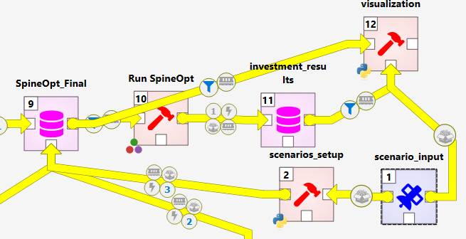

This page explains how to **use the Pan‑European Framework visualization tool** within your **Spine Toolbox** workflow to explore results produced by **SpineOpt**.

> Repository path: [`src/_visualization/`](https://github.com/spine-tools/Pan-European-Framework-Energy-System-Planning/tree/main/src/_visualization)



## Overview
The visualization tool is a **Python** utility ([`visualization.py`](https://github.com/spine-tools/Pan-European-Framework-Energy-System-Planning/blob/main/src/_visualization/visualization.py)) that reads a **SpineOpt results database** and the corresponding **SpineOpt model database**, processes the outcomes, and generates a set of plots such as:

- Installed capacity by technology and year
- New investments and decommissioning over time
- Energy production by technology
- A **map** of installed capacity distribution across Europe
- **Cumulative investment costs** over the modelling horizon
- **Sankey diagrams** for energy and emissions
- A **map of cross‑border flows** for relevant energy carriers

Configuration files under [`_visualization/config`](https://github.com/spine-tools/Pan-European-Framework-Energy-System-Planning/tree/main/src/_visualization/config) control **friendly names**, **scenario/technology mappings**, and **geospatial layers** for map figures. Edit these files to customize labels or to add/update shapefiles and region definitions.

## Prerequisites
- A working **Spine Python environment** (e.g., the environment you use to run Spine Toolbox/SpineOpt)
- Access to:
  - the **SpineOpt results DB** (output of your simulation)
  - the **SpineOpt model DB** (matching the run that produced the results)
  - the **scenario configuration** used for the run (see below)
- Create an output directory named `files_out` under `src/_visualization/` (or your chosen working directory) to store generated figures and data artifacts.

## Inputs
- **Results DB**: Path to the SpineOpt results SQLite database (or your configured DB engine).
- **Model DB**: Path to the SpineOpt model database corresponding to the same run.
- **Scenario configuration**: The YAML file created in the **setup** phase, typically located at:
  [`src/_planning-input-processsing/scenario_config.yml`](https://github.com/spine-tools/Pan-European-Framework-Energy-System-Planning/blob/main/src/_planning-input-processsing/scenario_config.yml)

> **Tip:** If you change technology names or add regions, update the mapping files under `_visualization/config/` so the plots display the desired labels.


## Streamlit app (optional)
After generating outputs, you can spin up a small **Streamlit** app to browse the figures and summary tables stored in `files_out/`:

```bash
# From src/_visualization/ (Spine Python environment active)
streamlit run app.py
```
- Script: [`app.py`](https://github.com/spine-tools/Pan-European-Framework-Energy-System-Planning/blob/main/src/_visualization/app.py)
- Ensure the `files_out/` directory exists and contains the artifacts created by `visualization.py`.

## Customization
- **Labels & mappings**: Edit YAML/CSV mapping files in `_visualization/config/` to change model and technology names displayed in plots.
- **Maps**: Replace or extend geospatial files in `_visualization/config/` to alter boundaries or add custom regions.
- **Figure styles**: Tweak plotting parameters in `visualization.py` if you need different color palettes, aggregation levels, or time scopes.

## Troubleshooting
- If maps don’t render, confirm that the geospatial files referenced in `_visualization/config/` exist and match your region naming.
- If no figures are produced, verify that **results and model DBs** are from the same run and that paths are correct.
- If you see argument errors, run `python visualization.py -h` to confirm the available flags for your version/branch.

